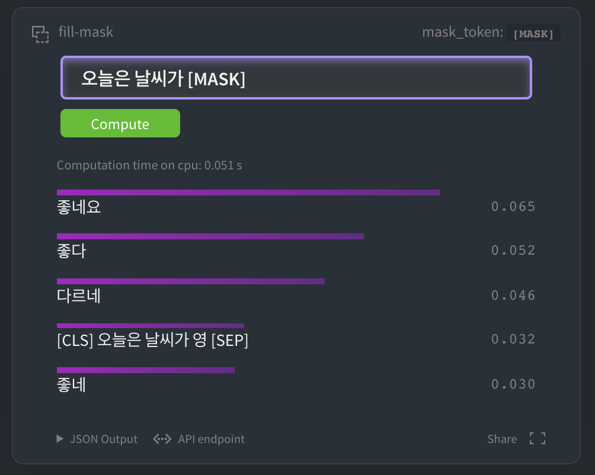

# KcBERT: Korean comments BERT

공개된 한국어 BERT는 대부분 한국어 위키, 뉴스 기사, 책 등 잘 정제된 데이터를 기반으로 학습한 모델입니다. 한편, 실제로 NSMC와 같은 댓글형 데이터셋은 정제되지 않았고 구어체 특징에 신조어가 많으며, 오탈자 등 공식적인 글쓰기에서 나타나지 않는 표현들이 빈번하게 등장합니다.

KcBERT는 위와 같은 특성의 데이터셋에 적용하기 위해, 네이버 뉴스에서 댓글과 대댓글을 수집해, 토크나이저와 BERT모델을 처음부터 학습한 Pretrained BERT 모델입니다.

KcBERT는 Huggingface의 Transformers 라이브러리를 통해 간편히 불러와 사용할 수 있습니다. (별도의 파일 다운로드가 필요하지 않습니다.)


## How to use

> Huggingface Model Page: https://huggingface.co/beomi/kcbert-base

- `pytorch ~= 1.5.1`
- `transformers ~= 3.0.1`

```python
from transformers import AutoTokenizer, AutoModelWithLMHead

tokenizer = AutoTokenizer.from_pretrained("beomi/kcbert-base")

model = AutoModelWithLMHead.from_pretrained("beomi/kcbert-base")

# BERT Large Model 공개 예정 

# tokenizer = AutoTokenizer.from_pretrained("beomi/kcbert-large")

# model = AutoModelWithLMHead.from_pretrained("beomi/kcbert-large")
```

## Train Data & Preprocessing

### Raw Data

학습 데이터는 2019.01.01 ~ 2020.06.15 사이에 작성된 **댓글 많은 뉴스** 기사들의 **댓글과 대댓글**을 모두 수집한 데이터입니다.

데이터 사이즈는 텍스트만 추출시 **약 15.4GB이며, 1억1천만개 이상의 문장**으로 이뤄져 있습니다.

### Preprocessing

PLM 학습을 위해서 전처리를 진행한 과정은 다음과 같습니다.

1. 한글 및 영어, 특수문자, 그리고 이모지(🥳)까지!

   정규표현식을 통해 한글, 영어, 특수문자를 포함해 Emoji까지 학습 대상에 포함했습니다.

   한편, 한글 범위를 `ㄱ-ㅎ가-힣` 으로 지정해 `ㄱ-힣` 내의 한자를 제외했습니다. 

2. 댓글 내 중복 문자열 축약

   `ㅋㅋㅋㅋㅋ`와 같이 중복된 글자를 `ㅋㅋ`와 같은 것으로 합쳤습니다.

3. Cased Model

   KcBERT는 영문에 대해서는 대소문자를 유지하는 Cased model입니다.

4. 글자 단위 10글자 이하 제거

   10글자 미만의 텍스트는 단일 단어로 이뤄진 경우가 많아 해당 부분을 제외했습니다.

5. 중복 제거

   중복적으로 쓰인 댓글을 제거하기 위해 중복 댓글을 하나로 합쳤습니다.

이를 통해 만든 최종 학습 데이터는 **12.5GB, 8.9천만개 문장**입니다.


## Tokenizer Train

Tokenizer는 Huggingface의 [Tokenizers](https://github.com/huggingface/tokenizers) 라이브러리를 통해 학습을 진행했습니다.

그 중 `BertWordPieceTokenizer` 를 이용해 학습을 진행했고, Vocab Size는 `30000`으로 진행했습니다.

Tokenizer를 학습하는 것에는 `1/10`로 샘플링한 데이터로 학습을 진행했고, 보다 골고루 샘플링하기 위해 일자별로 stratify를 지정한 뒤 햑습을 진행했습니다.

## BERT Model Pretrain

```json
{
    "max_position_embeddings": 300,
    "hidden_dropout_prob": 0.1,
    "pooler_size_per_head": 128,
    "hidden_act": "gelu",
    "initializer_range": 0.02,
    "num_hidden_layers": 12,
    "pooler_num_attention_heads": 12,
    "type_vocab_size": 2,
    "vocab_size": 30000,
    "hidden_size": 768,
    "attention_probs_dropout_prob": 0.1,
    "directionality": "bidi",
    "num_attention_heads": 12,
    "pooler_fc_size": 768,
    "pooler_type": "first_token_transform",
    "pooler_num_fc_layers": 3,
    "intermediate_size": 3072,
    "architectures": [
        "BertForMaskedLM"
    ],
    "model_type": "bert"
}
```

BERT Model Config는 Base, Large 기본 세팅값을 그대로 사용했습니다. (MLM 15% 등)

TPU `v3-8` 을 이용해 각각 3일, N일(Large는 학습 진행 중)을 진행했고, 현재 Huggingface에 공개된 모델은 1m(100만) step을 학습한 ckpt가 업로드 되어있습니다.

모델 학습 Loss는 Step에 따라 초기 200k에 가장 빠르게 Loss가 줄어들다 400k이후로는 조금씩 감소하는 것을 볼 수 있습니다.


학습은 GCP의 TPU v3-8을 이용해 학습을 진행했고, 학습 시간은 Small 기준 3일정도 진행했습니다. (Large Model은 아직 학습중입니다.)

## Example

### HuggingFace MASK LM

[HuggingFace kcbert-base 모델]([https://huggingface.co/beomi/kcbert-base?text=%EC%98%A4%EB%8A%98%EC%9D%80+%EB%82%A0%EC%94%A8%EA%B0%80+%5BMASK%5D](https://huggingface.co/beomi/kcbert-base?text=오늘은+날씨가+[MASK])) 에서 아래와 같이 테스트 해 볼 수 있습니다.



### NSMC Binary Classification (Acc: `.89048`)

[네이버 영화평 코퍼스](https://github.com/e9t/nsmc) 데이터셋을 대상으로 Fine Tuning을 진행해 성능을 간단히 테스트해보았습니다.

해당 테스트 코드는 [Colab](https://colab.research.google.com/gist/Beomi/c26cf67f9fb717d81141c579635816b2/kcbert-440k-nsmc.ipynb)에서 직접 실행해보실 수 있습니다.


> 더 다양한 Downstream Task에 대해 테스트를 진행하고 공개할 예정입니다.

## Acknowledgement


## Acknowledgement

KcBERT Model을 학습하는 GCP/TPU 환경은 [TFRC](https://www.tensorflow.org/tfrc?hl=ko) 프로그램의 지원을 받았습니다.

모델 학습 과정에서 많은 조언을 주신 [Monologg](https://github.com/monologg/) 님 감사합니다 :)

## Reference

### Github Repos

- [BERT by Google](https://github.com/google-research/bert)
- [KoBERT by SKT](https://github.com/SKTBrain/KoBERT)
- [KoELECTRA by Monologg](https://github.com/monologg/KoELECTRA/)

- [Transformers by Huggingface](https://github.com/huggingface/transformers)
- [Tokenizers by Hugginface](https://github.com/huggingface/tokenizers)

### Papers

- [BERT: Pre-training of Deep Bidirectional Transformers for Language Understanding](https://arxiv.org/abs/1810.04805)

### Blogs

- [Monologg님의 KoELECTRA 학습기](https://monologg.kr/categories/NLP/ELECTRA/)
- [Colab에서 TPU로 BERT 처음부터 학습시키기 - Tensorflow/Google ver.](/2020/02/26/Train-BERT-from-scratch-on-colab-TPU-Tensorflow-ver/)

